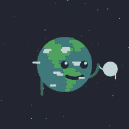

  <h1>Key Firdausi Alfarel</h1>
  
<i>Currently orbiting around AI, IoT, and Celestial Mechanics.</i>

  
   
  
    

  

    
    
    
  

 

  Hi. I am an informatics student who spends most of my time messing around with microcontrollers, backend logic, and looking up at the night sky.
    
  I like building systems that connect hardware to the internet. I prefer letting AI handle the boilerplate code so I can focus on the actual architecture, logic, and making things work efficiently. Work smart, not hard.

## What I'm Into

> **IoT & Embedded Systems**  
> Give me an ESP32, some sensors, and a message broker, and I will figure the rest out.

> **Practical AI**  
> I focus on how AI can optimize workflows and edge intelligence rather than typing everything from scratch.

> **Astronomy & Astrophotography**  
> Hunting for the Galactic Core, stacking photons, and processing deep-sky images.

## Tech Stack

  
<b>Languages & Backend</b>

  

    
    
    
    
    
    
  

  
<b>Embedded, IoT & Infrastructure</b>

  

    
    
    
    
    
    
  

## Beyond the Screen

When I am not debugging logic or wiring up hardware, you will probably find me:

* Going on solo motorcycle night rides to clear my head and find dark skies.
* Capturing the Galactic Core and processing astrophotography data.
* Enjoying the quiet as an introvert recharging away from the crowd.

## Cosmic Telemetry

  
  
  
    
  
<i>"Between silicon and starlight, there is always another system waiting to be understood."</i>

